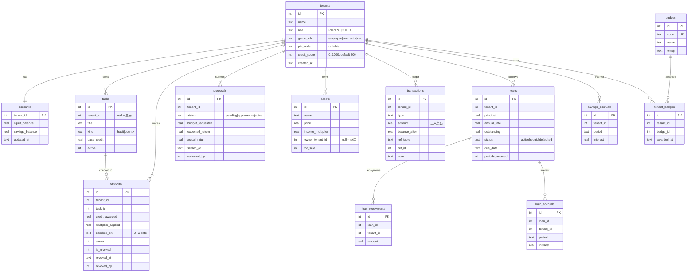
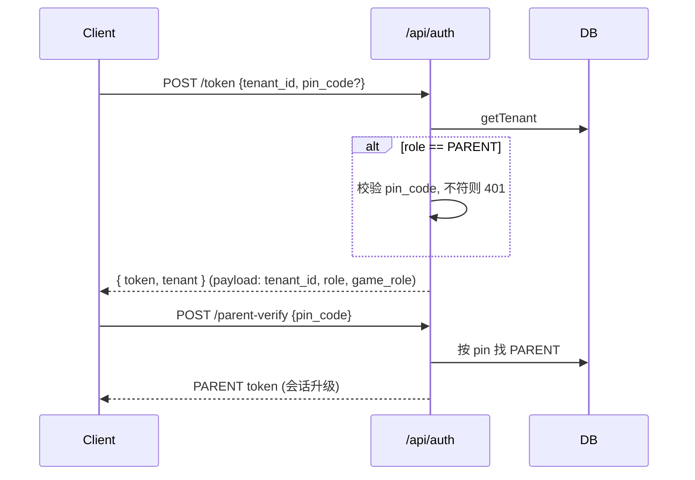
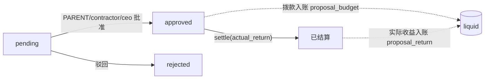
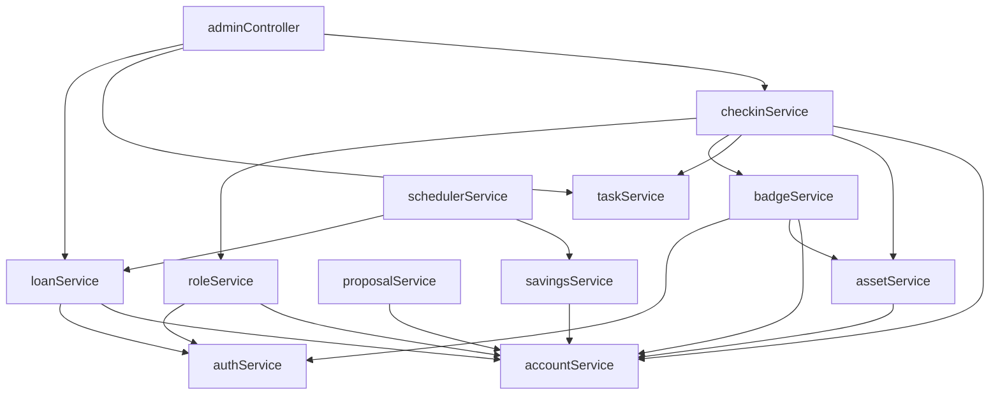

# 🧭 DESIGN — 成长沙盒 (Credit Incentive) 当前设计

> 本文档描述系统的**当前实现**,与代码逐项对应。使用说明见 [`README.md`](./README.md)。

## 1. 设计哲学

孩子从「按件计酬的打卡执行者」演进为「具备理财与决策能力的合伙人」。
两个正交轴贯穿全系统:

- **权限轴 `role`**:`PARENT`(全局 Admin) / `CHILD`(标准用户)。
- **成长轴 `game_role`**:`employee` → `contractor` → `ceo`,仅 `CHILD` 参与,随成就自动晋升。

原则:**家长供给,孩子消费**。任务、奖励、额度由家长设定;孩子只负责执行与决策。

## 2. 技术栈

| 层 | 选型 |
| --- | --- |
| 后端 | Node.js · Express 4 · TypeScript(strict) |
| 数据库 | SQLite via `better-sqlite3`(同步、WAL、外键开启) |
| 鉴权 | JWT(`jsonwebtoken`),Bearer Token,长效 |
| 校验 | `zod` v4 + `validate` 中间件 |
| 时间/货币 | ISO 周键 `YYYY-Www`;金额 `ROUND(x,2)` |
| 前端 | Vue 3 + Vite + Vue Router + Tailwind CSS + `lucide-vue-next` |
| 测试 | Vitest + Supertest(内存库 `:memory:`) |

## 3. 分层与目录

```text
src/
├── config/        环境配置(集中常量)
├── middleware/    auth / requireAdmin / requireRole / validate / error
├── controllers/   HTTP 边界:解析入参、调用 service、组织响应
├── routes/        路由与权限装配
├── services/      业务逻辑与事务(唯一写库入口)
├── db/            schema migrations / 连接 / seed / reset
├── models/        类型定义 + Express Request 增强
└── app.ts         中间件与静态托管;server.ts 启动 + 调度器
web/               Vue 前端(孩子视图 / 家长后台两套)
tests/             Vitest 接口测试
```

**规则**:Controller 不直接写库;所有写操作经 Service 并通过 `db.transaction()` 保证原子性。金额经 `utils/http.ts:round2`。错误统一 `HttpError(status, message, details)`。

## 4. 权限模型

```mermaid
flowchart LR
  Req[HTTP Request] --> AM[authMiddleware<br/>解析 Bearer JWT]
  AM --> Load[从 DB 读取最新 role/game_role]
  Load --> Ctx[注入 req.tenantId / tenantRole / tenantGameRole]
  Ctx --> RA{requireAdmin?}
  RA -- role=='PARENT' --> OK[放行]
  RA -- 否则 --> F403[403]
  Ctx --> RR{requireRole(...gameRoles)?}
  RR -- 命中 --> OK
  RR -- 否则 --> F403
```

- **鉴权**:`Authorization: Bearer <JWT>`;Payload = `{ tenant_id, role, game_role }`。
  中间件每次都从 DB 重新读取角色 → 权限变更即时生效。
- **家长保护**:`POST /api/auth/token` 对 `PARENT` 强制校验 `pin_code`;`POST /api/auth/parent-verify` 可用 PIN 把任意会话升级为 PARENT。
- **数据隔离**:所有查询以 `req.tenantId` 为界;`/api/admin/*` 需 `requireAdmin` 可跨孩子操作。

### 权限矩阵

| 能力 | CHILD | PARENT |
| --- | :--: | :--: |
| 查看本人任务 / 打卡 | ✅ | ✅ |
| 提交提案 | ✅ | ✅ |
| 兑换奖励 / 购买工具 | ✅ | ✅ |
| 储蓄 / 贷款 / 账单 | ✅ | ✅ |
| 创建/停用任务 | ❌ | ✅ |
| 上架/改价/下架资产 | ❌ | ✅ |
| 审批提案 / 结算收益 | ❌ | ✅ |
| 调整余额 / 信用分 | ❌ | ✅ |
| 撤销打卡并冲正 | ❌ | ✅ |
| 成员管理 / PIN | ❌ | ✅ |

## 5. 数据模型



约束要点:
- `accounts.tenant_id` 主键,1:1 于 tenants。
- `savings_accruals UNIQUE(tenant_id, period)`、`loan_accruals UNIQUE(loan_id, period)` → 同一周期**幂等**,重复计息返回 409。
- `tenant_badges UNIQUE(tenant_id, badge_id)` → 徽章只发一次。
- `tasks.tenant_id = NULL` 表示全局任务(所有孩子可见)。

### 迁移历史(`schema_migrations`)

| ver | 名称 | 内容 |
| --- | --- | --- |
| 1 | initial_schema | tenants/accounts/tasks/checkins/proposals/assets/transactions/loans/loan_repayments/savings_accruals + 索引 |
| 2 | seed_base_assets | 基础工具(计算器/自行车/笔记本) |
| 3 | gamification_and_finance | checkins 加 `checked_on/streak`;proposals 加 `actual_return/settled_at`;loans 加计息字段;新增 `loan_accruals/badges/tenant_badges` |
| 4 | seed_badges | 11 个徽章定义 |
| 5 | parent_admin_and_revocation | 引入 `game_role`;`role` 改为 PARENT/CHILD;`pin_code`;checkins 撤销字段 |
| 6 | parent_default_pin_0000 | 默认 PIN `1234 → 0000` |

## 6. 核心流程

### 6.1 鉴权与升级



### 6.2 打卡结算(含连击 / 乘数 / 徽章 / 晋升)

`checkinService.completeCheckin`,单事务内:

1. 校验任务属于本人或全局且 `active`。
2. 当日去重:同一 task 当天已有**未撤销**记录 → 409。
3. 连击:上一条未撤销记录日期 == 昨天 → `streak+1`,否则 `1`。
4. `multiplier = getIncomeMultiplier(tenant)`(所拥有资产乘数连乘,封顶 3x)。
5. `credit = round2(base_credit * multiplier)`;入账 `liquid`,`transactions(type=checkin_reward|bounty_reward)`。
6. 连击奖励:`streak % 7 == 0` 时额外 `round2(base_credit * 0.5)`,`type=streak_bonus`。
7. `evaluateBadges` → 解锁徽章,每枚发 `BADGE_REWARD` Credit。
8. `evaluateRole` → 满足条件则晋升并发放晋升奖金。

### 6.3 撤销打卡与账目冲正

```mermaid
sequenceDiagram
  participant P as PARENT
  participant API as /api/admin/check-in/:id/revoke
  participant DB
  P->>API: POST (requireAdmin)
  API->>DB: 读 checkin;已撤销则 409
  API->>DB: SUM(streak_bonus where ref=checkin)
  Note over API,DB: 事务开始
  API->>DB: checkins.is_revoked=1, revoked_at, revoked_by
  API->>DB: accounts.liquid -= (credit_awarded + streak_bonus)
  API->>DB: transactions(type=revoke_adjustment, 负数)
  Note over API,DB: 提交
  API-->>P: { reversed_amount, liquid_balance }
```

- 冲正金额 = 该次打卡 `credit_awarded` + 其关联 `streak_bonus` 流水之和。
- 撤销后连击查询(`listStreaks`、`alreadyToday`、`prev`)均排除 `is_revoked=1`。
- **徽章奖励不回收**(徽章是成就记录)。已知限制:撤销中间某天不回溯历史 `streak` 数值,仅影响后续计算。

### 6.4 复利储蓄(延迟满足)

- 期利率 `rate = SAVINGS_ANNUAL_RATE / SAVINGS_PERIODS_PER_YEAR`(默认 `0.12 / 52,周复利`)。
- `POST /api/financial/savings/accrue`(可带 `period`,默认当前 ISO 周):
  记 `savings_accruals`,利息入 `savings_balance`,`type=interest`。
- `POST /api/financial/savings/accrue-all`(CEO/PARENT)遍历所有 tenant。
- 幂等由 `UNIQUE(tenant_id, period)` 保证。

### 6.5 贷款与信用

- 额度:`maxLoan = credit_score * LOAN_CREDIT_PER_SCORE`(默认 `0.5`)。`requestLoan` 超限 400。
- 计息:`outstanding += principal * rate`,记 `loan_accruals`,累加 `periods_accrued`。
- 还款:`paid = min(amount, outstanding)`;扣 liquid;未清 `repaid` 时状态转 `repaid`;
  履约提升信用分(`round(ratio*20)`,全额清零再 +25)。
- 逾期:`markOverdueLoans()` 将 `due_date < today` 的 active 贷款置 `defaulted`,信用分 `-LOAN_DEFAULT_PENALTY`(默认 50)。

### 6.6 提案生命周期



- 提交:任何角色(`CHILD` 的决策训练)。
- 审批:`reviewProposal` 需 `PARENT` 或 `game_role ∈ {contractor, ceo}`;批准即拨预算。
- 结算:`settleProposal` 记 `actual_return` 并结算盈亏。

### 6.7 资产过户(工具/奖励)

- `createAsset`(PARENT)上架 → `assets.owner_tenant_id=NULL, for_sale=1`。
- 孩子 `purchaseAsset`:扣买方 liquid;若资产已有主人则**货款转给出卖方**(`asset_sale`),否则为商店。
- `updateAsset`(PARENT)改价/上下架;`listAssetForSale` 挂牌。
- 收益乘数 = 拥有资产 `income_multiplier` 连乘,`asset.multiplierCap=3` 封顶。

### 6.8 角色晋升(`roleService`)

`CHILD` 达标自动晋升(并发奖金 50,`type=promotion_bonus`):

| 晋升 | 条件(默认) |
| --- | --- |
| employee → contractor | 通过提案 ≥ 1 且 拥有资产 ≥ 1 |
| contractor → ceo | 还清贷款 ≥ 1 且 储蓄 ≥ 100 且 信用分 ≥ 700 |

`PARENT` 不参与晋升。

### 6.9 调度器(`schedulerService`)

`SCHEDULER_ENABLED=true` 时按 `SCHEDULER_INTERVAL_MS` 周期性执行:
储蓄复利 `accrueInterestForAll` + 贷款计息 `accrueInterestForAllLoans` + 逾期处理 `markOverdueLoans`。
重复周期由唯一约束幂等跳过。

## 7. 账本类型(`transactions.type`)

| 分类 | 类型 |
| --- | --- |
| 打卡 | `checkin_reward` `bounty_reward` `streak_bonus` |
| 游戏化 | `badge_reward` `promotion_bonus` |
| 冲正/管理 | `revoke_adjustment` `admin_adjustment` `adjustment` |
| 提案 | `proposal_budget` `proposal_return` |
| 资产 | `asset_purchase` `asset_sale` |
| 储蓄 | `savings_deposit` `savings_withdraw` `interest` |
| 贷款 | `loan_disbursement` `loan_repayment` `loan_interest` |

`amount` 正数入账、负数出账;`balance_after` 记录流动账户余额快照;`ref_table/ref_id` 关联业务实体。

## 8. 服务依赖



> `checkinService` 单点聚合了打卡的全部副作用;`evaluateBadges`/`evaluateRole` 由 Controller 在购买/审批/还款后显式触发,避免循环依赖。

## 9. 配置项(`.env` / `config`)

| Key | 默认 | 含义 |
| --- | --- | --- |
| `PORT` | 3000 | 服务端口 |
| `JWT_SECRET` | dev 值 | 签名密钥(**上线必改**) |
| `JWT_EXPIRES_IN` | 3650d | Token 有效期 |
| `DB_PATH` | ./data/credit_incentive.db | SQLite 路径(测试用 `:memory:`) |
| `PARENT_DEFAULT_PIN` | 0000 | 新家长默认 PIN |
| `SAVINGS_ANNUAL_RATE` / `SAVINGS_PERIODS_PER_YEAR` | 0.12 / 52 | 复利 |
| `LOAN_ANNUAL_RATE` / `LOAN_PERIODS_PER_YEAR` | 0.18 / 52 | 贷款计息 |
| `LOAN_CREDIT_PER_SCORE` | 0.5 | 额度系数 |
| `LOAN_DEFAULT_PENALTY` | 50 | 逾期扣分 |
| `CREDIT_SCORE_MIN/MAX` | 0 / 1000 | 信用分边界 |
| `BADGE_REWARD` | 10 | 徽章奖励 |
| `CONTRACTOR_MIN_*` / `CEO_MIN_*` | 见 §6.8 | 晋升门槛 |
| `SCHEDULER_ENABLED` / `SCHEDULER_INTERVAL_MS` | false / 3600000 | 调度器 |

## 10. 前端架构

- **两套视图,完全隔离**(路由 `meta.mode` + 守卫):
  - 孩子:`/`(仪表盘) `/tasks` `/proposals` `/shop` `/finance`。
  - 家长:`/admin`(孩子看板+撤销) `/admin/tasks` `/admin/rewards` `/admin/proposals` `/admin/members` `/admin/settings`。
- 守卫规则:家长访问孩子页 → `/admin`;孩子访问 `/admin/*` → `/`;登录/升级后按角色落点。
- 状态:`web/src/store.ts`(reactive:token/profile/tenants/toast);API:`web/src/api.ts`(类型化 fetch,自动注入 Bearer)。
- 设计语言:Tailwind 靛蓝主题 + Lucide 图标;`styles.css` 用 `@apply` 定义 `card/btn/input/chip`。

## 11. 测试策略(`tests/`)

- 每文件独立进程 + 独立内存库(`setup.ts` 设 `DB_PATH=:memory:`);不触磁盘。
- 覆盖:鉴权与隔离、PIN/升级、打卡(乘数/连击/徽章/当日去重)、撤销冲正、储蓄/贷款/逾期、资产过户与家长专属、admin 看板与调整。
- 运行:`npm test`(25 cases)。

## 12. 关键决策与已知限制

| 决策 | 理由 / 限制 |
| --- | --- |
| 双轴角色 | 权限与成长解耦,家长不因游戏进度获得/失去权限 |
| 同步 Better-SQLite3 | 单文件、零运维、事务简单;写操作串行,适合单机家庭场景 |
| 撤销只冲正本次打卡 Credit | 不回收徽章奖励;不回溯历史 streak 数值(仅影响后续计算) |
| 店铺资产 = 奖励/工具同表 | `income_multiplier=1` 即纯奖励,`>1` 即生产力工具 |
| 贷款自动批准 | 以信用分额度约束替代人工审批(如需人工审批可加 `pending` 状态) |
| `pin_code` 明文存储 | 家庭内网场景;公网部署应改哈希 + 限流 |

## 13. 可扩展方向

- 贷款人工审批流(pending → approved)与分期计划。
- 徽章条件外置为配置/规则表,支持自定义。
- 撤销时级联重算后续 `streak`。
- 多家庭 / 多租户群组、审计日志导出、报表。
- WebSocket 实时余额与打卡推送。
